# Effective Java, Third Edition

## Hot News! Source code finally available on GitHub. Happy Hacking!
- Item 1: static Factory instead of constructor
    - they have name (maintanable) 
    - can cache ( don't require to create new object each time -- like singleton) 
    - return an object of any subtype of their return type
      - [ex](src/effectivejava/chapter2/item1/Factory1.java)
    - static factories is that the class of the returned
      object can vary from call to call as a function of the input parameters
      - [ex](src/effectivejava/chapter2/item1/Factory1.java)
    - A fifth advantage of static factories is that the class of the returned object
      need not exist when the class containing the method is written. 
      - [ex](src/effectivejava/chapter2/item1/ex) -- some [reflection](https://viblo.asia/p/javahuong-dan-java-reflection-djeZ1bMglWz) required
    - **Limitation**:
      - something 

- Item 2: Builder pattern
    - solve constructor with too many params (maintainable, hard to read)  
    - we can use set through app but it not thread-safe (multi thread can access to this and cause race condition -- can give field as final to solve)
    - required and optional need too much overload to implemented 
      - 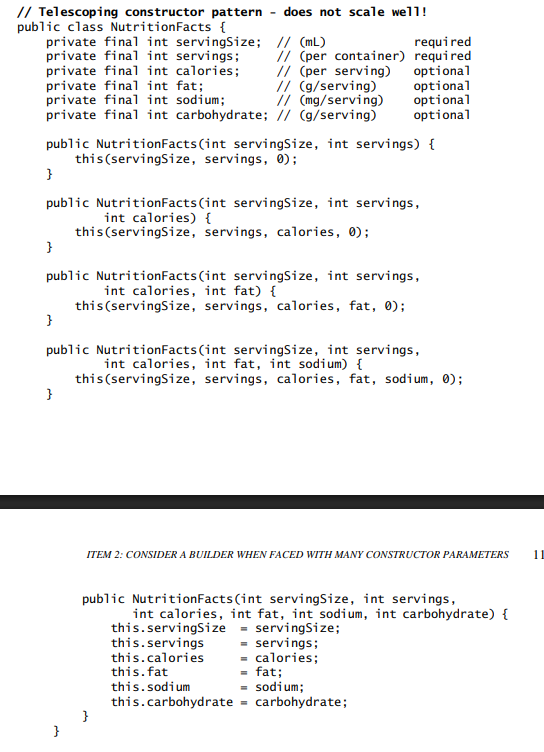
- Item 3: Enforce the singleton property with a privaet constructor or an enum type
  - Making a class a singleton can make it difficult to test its clients
- Item 4: create private constructor over abstract class if not wanted inheritanced
- Item 5: prefer depenedeny injection (spring container, bean)
- Item 6: Avoid creating unnessary object 
  - String heap 
    - [ex](src/effectivejava/chapter2/item6/Test.java)
    - 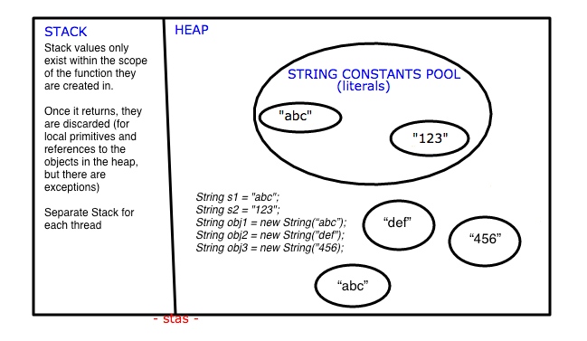
    - 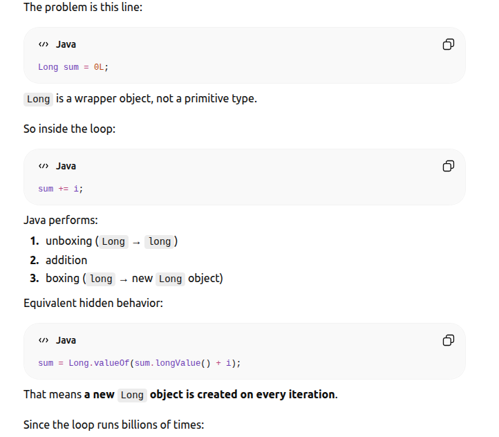 
    - [ex](src/effectivejava/chapter2/item6/Sum.java)
- Item 7: Eliminate obsolete object reference 
- Garbage Collector
  - set up garbage log 
  - 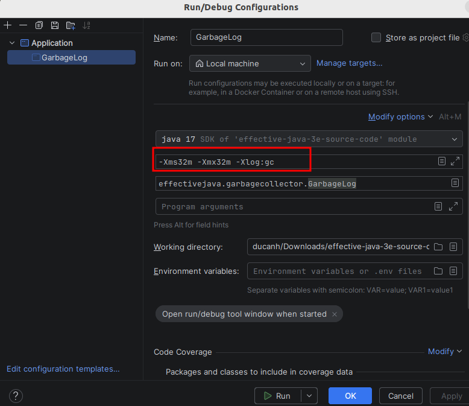
  - 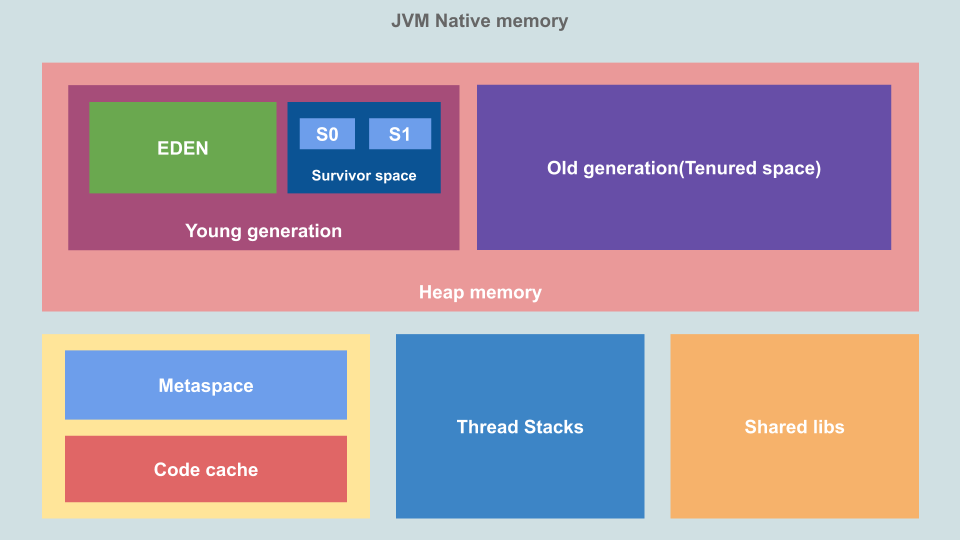
  - 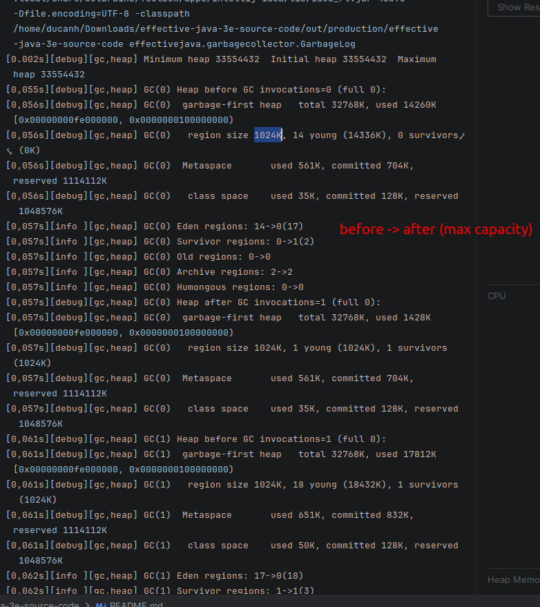
  - divide to multi region for perfomane, gc not to scan entire 
  - 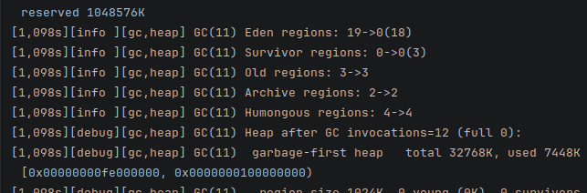
  - 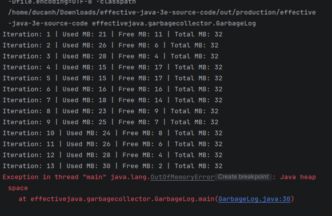
  - Enterprise gc is too hard to read and learn with fast demoable
  - Read here for gc from scratch [may be easier approach](https://buildx.substack.com/p/lets-build-a-garbage-collector-gc)
- Item 8: not too considered
- Item 9: Prefer try with resource to try finally
- Item 10: Prefer overide equals 
  - default equals inherited from Object class with == (reference compare) internally
  - 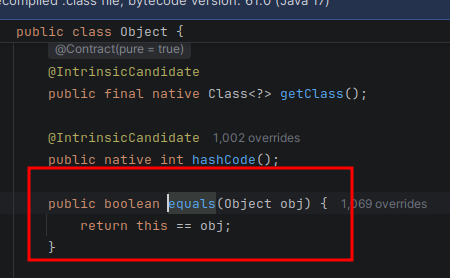
- Item 11: Prefer overide hashCode, on hash collection, if not overide same value object can be have different hashCode as default Object class then overide it with actual object value with prime number for minized collision 
  - [ex](src/effectivejava/chapter3/item11/Test.java)
- Item 12: Prefer overide toString (easy)
- Item 13: Prefer clone via constructor or factory method
  - clone method just copy reference, not actual create the new one as expected, some mutable case is very careful
  - 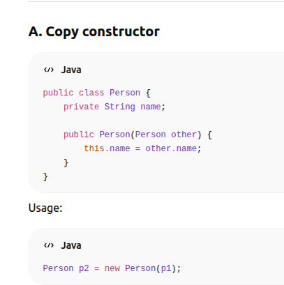
  - 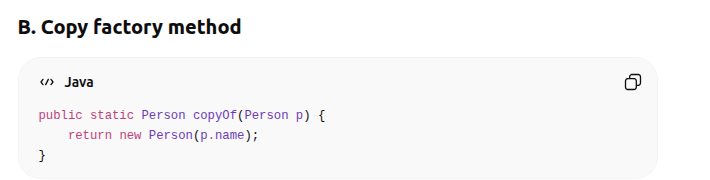
- Item 14: Implement Comparable for sort function
- Item 15: Minimize the accessibility of classes and members
  - encapsulation priciple, if public, out side can access and edit easily without validation and logic rule (debug hard and not effective management )
  - just move to private and define `get/set` function with constraint logical validation
  - 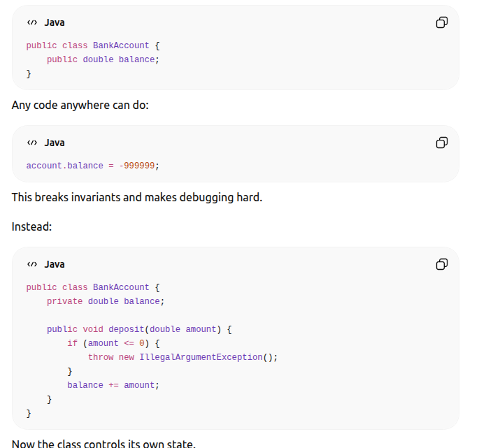
- Item 16: using public accessor (get/set) -- same with item 15
- Item 17: Minimize mutability ( prefer immutable by default )
  - Immutable objects are easier to:
    - understand
    - use
    - share safely
    - cache
    - reuse
    - test
    - maintain
    - They are also naturally:
      - thread-safe
      - failure-atomic
      - secure against accidental modification
    - Examples in Java:
      - String
      - Integer
      - BigInteger
      - LocalDate
      - UUID
- Item 18: 
  - 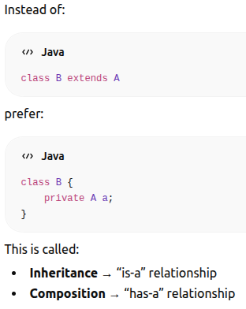
- Item 19: view example for better; call Parent func in parent constructor is already inheritanced then attribute still null on child because it not construct yet -> null value
- Item 20: prefer interface to abstract class 
    - Interface = contract 
      Abstract class = base implementation
    - Personally I think the main difference of this is share state / instance state, abstract can have attribute that store state of an object interface not, (for base implementation `default` method in interface solved)
    - Interface make more expendable ( if change method in interface it may break all implemtation but default method maybe solved it ), testable and flexible
- Item 21:
  - Design interfaces carefully before publishing
  - Expect evolution but minimize need for changes
  - Prefer adding new interfaces over modifying old ones
- Item 22: Use interface just for define type 
- Item 23: hierachy design
- Item 24: prefer static inner class for easy constructor 
- Item 25: nothing
- Item 26: genrics 
- Item 34: enum and annotations
- Item 42: Lambda over anonymous function
  - 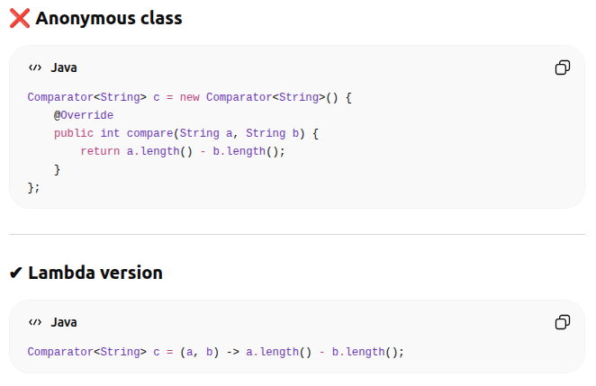
- Item 43: prefer method ref than lambda ( lambda use for conditional, for get just use ref) 
  - [ex](src/effectivejava/chapter7/item43)
- Item 44: Favor use standard functional interface
- Item 45: 
  - ✔ Data transformations
    ✔ Filtering
    ✔ Mapping
    ✔ Aggregations
    ✔ Pipeline-style processing
  - ```java
        List<String> result = list.stream()
        .filter(s -> s.startsWith("A"))
        .map(String::toUpperCase)
        .toList();
     ```
  - 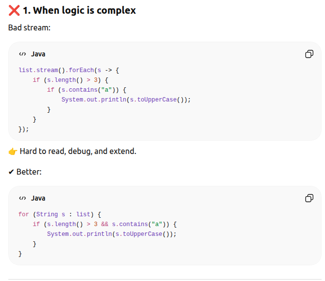
- Item 46: 
- Item 48: Paralel stream 
  - core (process) -> process and thread, cost of context swicth of process greater than thread (), process isolate memory resource, thread share memory, thread is child of a process, process can have many thread 
  - 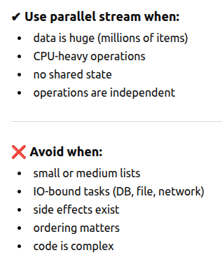
  - 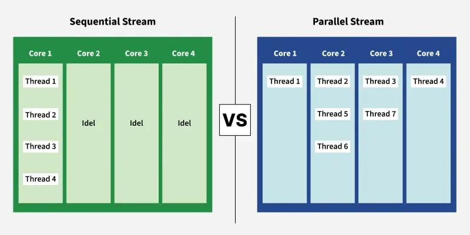
  - https://javarevisited.blogspot.com/2020/08/java-8-parallelstream-example.html#
- Item 80: Prefer executors, tasks, and streams to threads
- Item 81: 


# Java Interview Question

## OOP:

- four type:
  - Abstraction: 
    - Interface and Abstract Class:
      - Interface: default public [static] abstract method (no body), java 8 default method, public static final attribute always static (Interface own the state), A class can implements multi intefaces 
      - Abstract class: can have both abstract method and normal method (have body), attribute can be static for normal (Instane own the state), A class just extends from only one class 
      ## Q1 Why a class just extends by a class, but implements multi interface
      ## A1
        ```java
        class A {
          public void a() {
           System.out.print("test")
          }
        }
        class B{
          public void a() {
            System.out.print("test1")
          }
        }
        class C extends A, B {
            int doStuff() { 
          return super.a(); // Which superclass method is called?
        }
        ```
      ## Q2 What the difference between Interface and Abstract Class 
      ## A1
      - attribute: interface own the state (Interface), instance own the state (Abstract Class)
      - method: interface only has abstract method, Abstract Class has both 
  - Inheritance 
   ```java
    class A {
       public void a() {
        
       }
    }
    class B extends A {

    }
    b = new B() 
    b.a() <-- inheritance
   ```
  - Polimorphism 
    - override:
      - override the function that `inheritanc`e or `implement from interface`
      ```java
      --- implement interface
      interface Animal {
          void makeSound();
      }

      class Dog implements Animal {

          @Override
          public void makeSound() {
              System.out.println("Woof!");
          }
      }

      public class Main {
          public static void main(String[] args) {
              Dog dog = new Dog();
              dog.makeSound();
          }
      }


      --- inheritance
      class Animal {
        void makeSound() {
            System.out.println("Animal sound");
            }
        }

      class Dog extends Animal {
            @Override
            void makeSound() {
                System.out.println("Woof!");
            }
        }

      public class Main {
            public static void main(String[] args) {
                Dog dog = new Dog();
                dog.makeSound();
            }
        }
      ```
    - overload: 
      - It's the sets of function that have the same name but `different number of parameters` and `data types`
      ```java
      class Calculator {

          int add(int a, int b) {
              return a + b;
          }

          // Different numbers of parameter 
          int add(int a, int b, int c) {
              return a + b + c;
          }

          // Different parameter data types
          double add(double a, double b) {
              return a + b;
          }
      }
      ```
  - Encapsulation:
    - for hiding / protecting the privacy of implementation and attribute we just use `public set/get function` to get the `private thing` 


## Java Memory Model 
  - stack: store params of function, function call, return value, primitive data type (int, char, boolean, double, long,..) 
  - heap: store the object that required `dynamic address allocation` (through `new()`)
  ### Q1: Whether java is `pass-by-value` or `pass-by-reference` 
  ### Q2: always pass-by-value
  ```java
  public class Main {

    static void change(int x) {
        x = 100;
    }

    public static void main(String[] args) {
        int a = 10;

        change(a);

        System.out.println(a); // 10
    }
  }

    class Person {
      String name;
  }

  public class Main {

      static void changeName(Person p) {
          p = new Person(); <-- create new object heap | seem like `immutable` -> race condition -> multi thread
          p.name = "Bob";
          System.out.println(System.identityHashCode(p));
      }

      public static void main(String[] args) {
          Person person = new Person();
          person.name = "Alice";
          System.out.println(System.identityHashCode(person));
          changeName(person);

          System.out.println(person.name); // Bob 
      }
  }
  ```

## String
  ### StringBuffer, StringPool, StringBuilder (already talked)
  [ex](./src/effectivejava/StringBuildervsStringBuffer/)

## Concurency Java
  - race condition: multi-thread access and edit the same resource in the same time  
  - synchronized, reetrantlock, atomic,...
  - deadlock: thread A lock resource in thread B, thread B lock resource in thread A  -> infinitive lock 
    - lock timout 
    - deadlock detection 

## Collections
### HashMap, HashSet 
- hashmap, hashset implementation (hash function, element value % (bucket size)), time complexity O(1)
- hashmap collision (duplicate key hash) -> append bucket to a linked list
- hashcode, equals

# Spring
## AOP 
- Joincut
## Anotation Transaction 
- reflect class, proxy, rollback when throw the runtimeexception 
`Unchecked Exceptions`: Any subclass of `RuntimeException` (e.g., NullPointerException, IllegalArgumentException) triggers a rollback.
- Errors: Severe system errors (e.g., `OutOfMemoryError`) trigger a rollback.
- `Checked Exceptions`: Exceptions like `IOException` or `SQLException` do not trigger a rollback by default. Spring assumes checked exceptions are handled programmatically.
- Propgration (new_requrie, )(rollbackFor = Exception.class)
## Dependencie Injection 
## Bean LifeCycle 
## Spring Security lifecycle
## Permistic Lock and Optimistic Lock
[ex1](./src/effectivejava/PermisticLock/)
[ex2](./src/effectivejava/OptimisticLock/)
https://freedium-mirror.cfd/https://itnext.io/jpa-optimistic-vs-pessimistic-locking-in-practice-f6dd100eddb2


# Database 
## Isolaton Level 
- read uncommited
- read commited
- repeatable read
- serialzable
## Partition  
## Table space 
## Indexing
## Sharding 


# Design Pattern 
## SOLID 
https://gpcoder.com/4200-cac-nguyen-ly-thiet-ke-huong-doi-tuong/
- S: Single Responsibility: one class, method just have only one purpose 
      ```python 
        # print 
        class Book:
            def __init__(self,name,publish_date, publisher): 
            def getName() 
            def setName() 
            def printBook(): 

        class Newspaper:
            def __init__(self,name,publish_date, newsroom): 
            def printNewspaper(): 

        
        
        # convert print task for commonly use -- apply single responsibility 
        interface Printerable

        class Book implemnts Printerable:
            def __init__(self,name,publish_date, publisher): 
            def getName() 
            def setName() 

        class Newspaper implemnts Printerable:
            def __init__(self,name,publish_date, newsroom): 


        class Printer: 
            def print(Printerable p):
              print(p.name, p.publish_date)
              if p == instanceof Book: 
                print(publisher)
              if p == instanceof Newspaper:
                print(newsroom)
      ```
- O: Open-close Principle: we're trying to avoid edit the old class
    ```python
      // add validate function without changing Book, Newspaper
      interface Validatable

      class Validator: 
        def validate(Validatable p):
    ```
- L: Liskov Principle: child class not cause parent class change 

    ```python
      class ChildBook(Book):
        def __init(type):
        def getName():
            throw Exception // XXXXXXX change programming behavior correctness 
    ```
- I: interface: we trying to extract the large interface to many small one
```python 
interface PrinterValitable
class ChildBook:
```
- D: Dependency Injection: Dynamically resolving object (through inteface or extension, contructor, field - attribute) 
```python
    class A:
    class B: 
    class C:
      def __init__(self, A a, B b):
        this.a = a
        this.b = b
      def setA(A a): 
        this.a = a
```